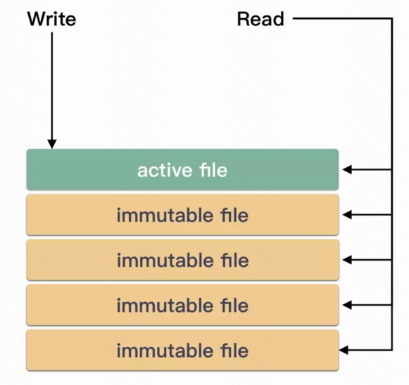
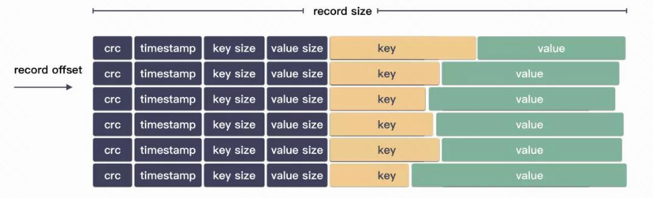
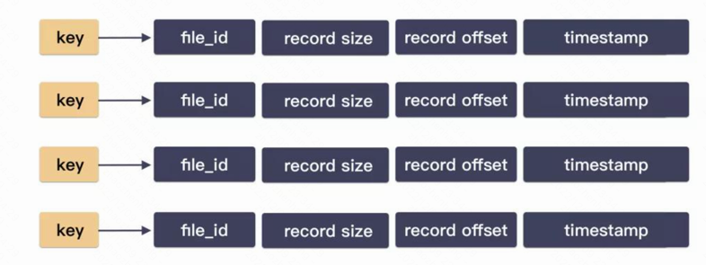
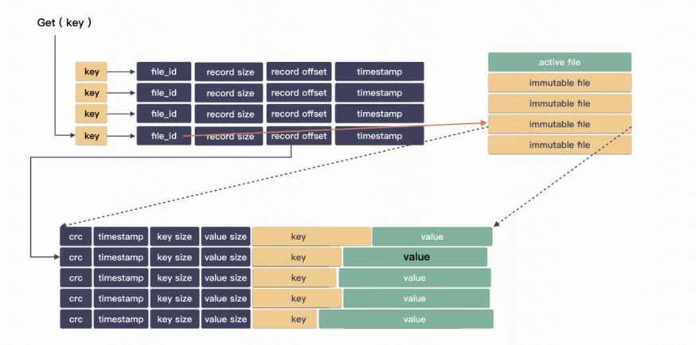

# 
XKV

## BitCask
- #### Bitcask has only one writable file. Writable files are called active files and read-only files are called non-active:

- #### Bitcask files formatted:

- #### The index structure of memory:

- #### Query process:

### TODO!
1. Supports high-performance range query
2. Index persistence
3. wal (under consideration)
4. Multi thread safe write
5. File partition